# SPEAR Application Flowchart

## Overview

This document contains the application flowchart for SPEAR, showing the high-level structure and feature organization. Note that this flowchart represents an earlier vision of SPEAR and may not reflect the current production implementation.

## ⚠️ Current Status Note

**This flowchart is from an earlier development phase and includes features that may not be implemented in the current production system. For current system architecture, see [System Overview](overview.md).**

## Application Structure Flowchart

```mermaid
flowchart TD
    %% Main Application Structure
    SPEAR[SPEAR Application] --> UserInterface[User Interface]
    SPEAR --> AdminInterface[Admin Interface]
    SPEAR --> CoreFeatures[Core Features]
    SPEAR --> MarketingToDos[Marketing To-Dos]

    %% User Interface Breakdown
    UserInterface --> Dashboard[Client Dashboard]
    UserInterface --> RemoteAccess[Remote Access]
    UserInterface --> Subscriptions[Subscription Management]
    UserInterface --> Support[Support & Help]

    %% Admin Interface Breakdown
    AdminInterface --> AdminDashboard[Admin Dashboard]
    AdminInterface --> DeviceManagement[Device Management]
    AdminInterface --> ClientManagement[Client Management]
    AdminInterface --> Analytics[Analytics & Reporting]
    AdminInterface --> Settings[System Settings]

    %% Core Features Breakdown
    CoreFeatures --> RemoteControl[Remote Device Control]
    RemoteControl --> RustDeskInt[RustDesk Integration]

    CoreFeatures --> LocationVerification[Location Verification]
    CoreFeatures --> ComplianceSolutions[Compliance Solutions]
    CoreFeatures --> KnowledgeBase[Knowledge Base]
    CoreFeatures --> BlogSystem[Blog System]

    %% Remote Control Details (Updated for RustDesk)
    RustDeskInt --> RDDashboard[RustDesk Dashboard]
    RustDeskInt --> RDStatus[RustDesk API Status]
    RustDeskInt --> RDBulkOps[RustDesk Bulk Operations]
    RustDeskInt --> RDProvisioning[RustDesk Device Provisioning]

    %% Location Verification Details
    LocationVerification --> Geofencing[Geofencing]
    LocationVerification --> LocationAuth[Location-based Authentication]
    LocationVerification --> AuditTrail[Audit Trail]

    %% Compliance Solutions Details
    ComplianceSolutions --> AutoVerification[Automated Verification]
    ComplianceSolutions --> SecureDocumentation[Secure Documentation]
    ComplianceSolutions --> TimeBasedAccess[Time-based Access Controls]

    %% Knowledge Base Details
    KnowledgeBase --> Articles[Article Management]
    KnowledgeBase --> Search[Search Functionality]
    KnowledgeBase --> Categories[Categorization]

    %% Blog System Details
    BlogSystem --> FeaturedArticles[Featured Articles]
    BlogSystem --> SEOContent[SEO-optimized Content]
    BlogSystem --> LuxuryDesign[Luxury Design]

    %% Marketing To-Dos
    MarketingToDos --> ContentCreation[Content Creation]
    MarketingToDos --> SEOStrategy[SEO Strategy]
    MarketingToDos --> SocialMedia[Social Media Presence]
    MarketingToDos --> TargetedCampaigns[Targeted Campaigns]
    MarketingToDos --> AnalyticsTracking[Analytics Tracking]

    %% Content Creation To-Dos
    ContentCreation --> BlogPosts[Create Blog Posts]
    ContentCreation --> CaseStudies[Develop Case Studies]
    ContentCreation --> KnowledgeArticles[Write Knowledge Articles]
    ContentCreation --> ProductDemos[Record Product Demos]

    %% SEO Strategy To-Dos
    SEOStrategy --> KeywordResearch[Keyword Research]
    SEOStrategy --> OnPageSEO[On-Page SEO Optimization]
    SEOStrategy --> BacklinkStrategy[Backlink Strategy]
    SEOStrategy --> LocalSEO[Local SEO Implementation]

    %% Social Media To-Dos
    SocialMedia --> LinkedInPresence[LinkedIn Business Presence]
    SocialMedia --> TwitterUpdates[Twitter Product Updates]
    SocialMedia --> FacebookAds[Facebook Ad Campaigns]
    SocialMedia --> ContentCalendar[Social Media Calendar]

    %% Targeted Campaigns To-Dos
    TargetedCampaigns --> ComplianceIndustries[Target Compliance-Heavy Industries]
    TargetedCampaigns --> RemoteWorkSolutions[Remote Work Solutions Campaign]
    TargetedCampaigns --> SecurityFocus[Security & Verification Focus]
    TargetedCampaigns --> CostSavings[Cost Savings Messaging]

    %% Analytics Tracking To-Dos
    AnalyticsTracking --> SetupGA[Setup Google Analytics]
    AnalyticsTracking --> ConversionTracking[Implement Conversion Tracking]
    AnalyticsTracking --> HeatMapping[Install Heatmapping Tools]
    AnalyticsTracking --> ABTesting[A/B Testing Framework]

    %% Styling
    classDef core fill:#f9f,stroke:#333,stroke-width:2px
    classDef interface fill:#bbf,stroke:#333,stroke-width:1px
    classDef feature fill:#bfb,stroke:#333,stroke-width:1px
    classDef marketing fill:#fbb,stroke:#333,stroke-width:1px
    classDef detail fill:#ddd,stroke:#333,stroke-width:1px

    class SPEAR core
    class UserInterface,AdminInterface interface
    class CoreFeatures,RemoteControl,LocationVerification,ComplianceSolutions,KnowledgeBase,BlogSystem feature
    class MarketingToDos,ContentCreation,SEOStrategy,SocialMedia,TargetedCampaigns,AnalyticsTracking marketing
    class Dashboard,RemoteAccess,Subscriptions,Support,AdminDashboard,DeviceManagement,ClientManagement,Analytics,Settings detail
    class RustDeskInt,Geofencing,LocationAuth,AuditTrail,AutoVerification,SecureDocumentation,TimeBasedAccess detail
    class RDDashboard,RDStatus,RDBulkOps,RDProvisioning detail
    class Articles,Search,Categories,FeaturedArticles,SEOContent,LuxuryDesign detail
    class BlogPosts,CaseStudies,KnowledgeArticles,ProductDemos,KeywordResearch,OnPageSEO,BacklinkStrategy,LocalSEO detail
    class LinkedInPresence,TwitterUpdates,FacebookAds,ContentCalendar,ComplianceIndustries,RemoteWorkSolutions,SecurityFocus,CostSavings detail
    class SetupGA,ConversionTracking,HeatMapping,ABTesting detail
```

## Current Implementation Status

### ✅ Implemented Features

**User Interface:**
- ✅ Client Dashboard (basic)
- ✅ Subscription Management (PayPal integration)
- ✅ Support & Help (customer service API)

**Admin Interface:**
- ✅ Admin Dashboard (subscription monitor)
- ✅ Client Management (subscription management)
- ✅ Analytics (basic subscription metrics)

**Core Features:**
- ✅ Remote Device Control (RustDesk integration)
- ✅ RustDesk Integration (production server deployed)

### 🚧 Partially Implemented

**User Interface:**
- 🚧 Remote Access (RustDesk client configuration)

**Admin Interface:**
- 🚧 Device Management (basic device tracking)
- 🚧 System Settings (environment configuration)

### ❌ Not Implemented

**Core Features:**
- ❌ Location Verification
- ❌ Compliance Solutions
- ❌ Knowledge Base
- ❌ Blog System

**Marketing Features:**
- ❌ Content Creation system
- ❌ SEO Strategy implementation
- ❌ Social Media integration
- ❌ Targeted Campaigns
- ❌ Analytics Tracking (beyond basic metrics)

## Current vs Planned Architecture

### Current Production Focus

The current SPEAR production system focuses on:
1. **Subscription Management**: PayPal payment processing
2. **Remote Access**: RustDesk server integration
3. **Admin Control**: Subscription monitoring and device access control
4. **Mobile Support**: Responsive design for mobile devices

### Future Development Roadmap

Based on this flowchart, potential future features include:
1. **Enhanced Analytics**: Comprehensive reporting dashboard
2. **Knowledge Base**: Customer self-service documentation
3. **Location Verification**: Geofencing and location-based access
4. **Compliance Tools**: Automated verification and documentation
5. **Marketing Integration**: SEO and social media tools

## Notes

- **Remote Access**: Production uses RustDesk for all remote device management
- **Discord Integration**: Originally planned but not implemented in current production
- **Marketing Features**: Extensive marketing automation was planned but not prioritized for MVP
- **Compliance Features**: Advanced compliance tools are planned for future enterprise features

---

**Reference**: This flowchart serves as a historical reference for the original SPEAR vision and a roadmap for potential future development. Current system architecture is documented in [System Overview](overview.md).
